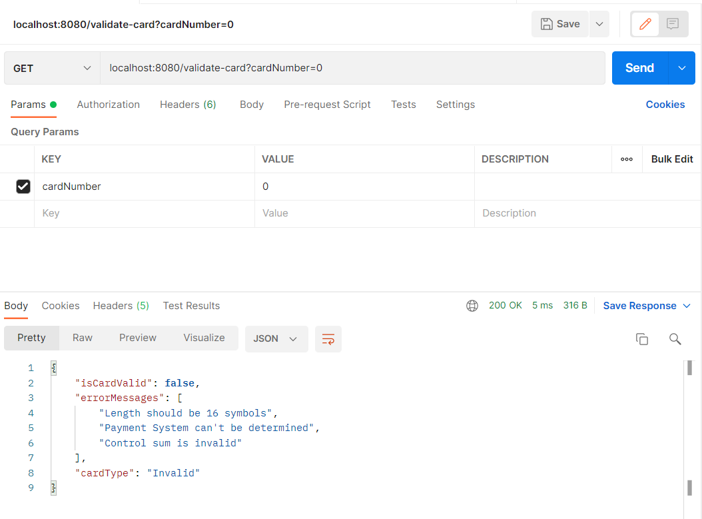
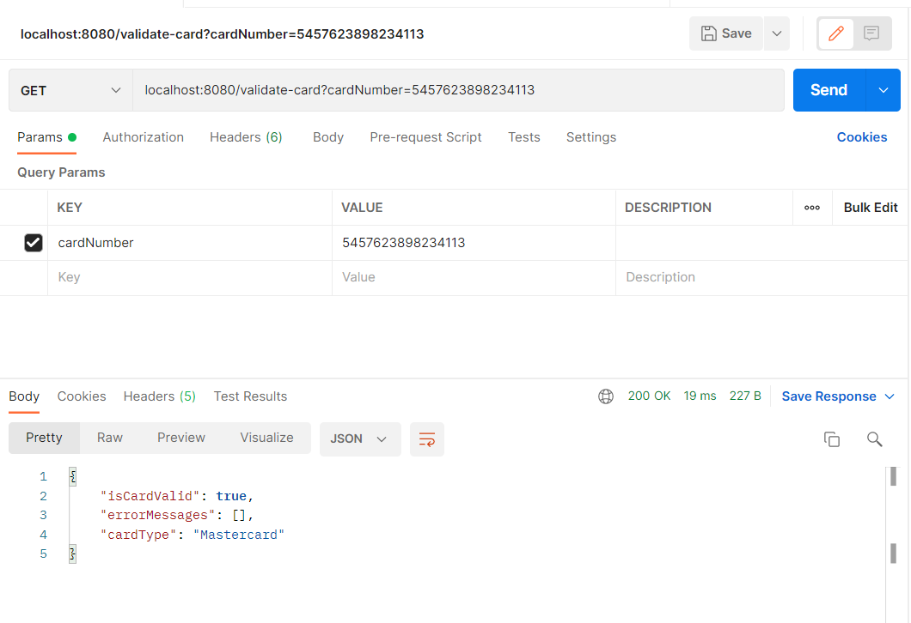
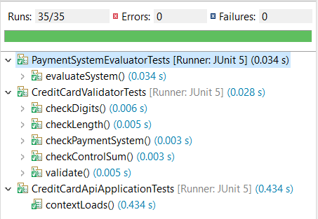
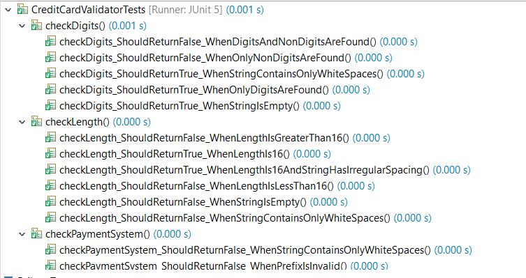
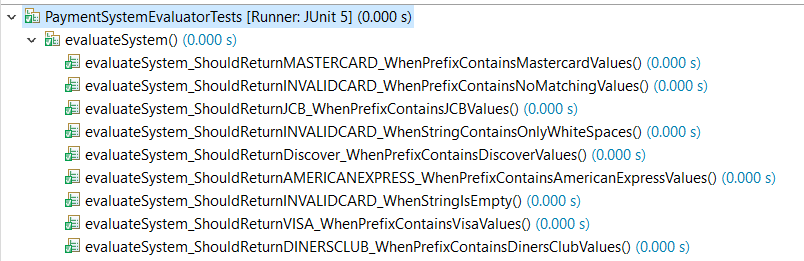

# Credit Card Validator Api

 

The credit card validator API accepts requests with a request parameter "cardNumber", which has a value of the credit card number being validated. A JSON response is returned with the values isCardValid, which is true when the card is valid, false otherwise, an array of error messages displaying what makes the card number invalid, and "cardType", which displays the type of credit card provided.
 
Several request examples are displayed below through Postman

 

 

The above picture displays what response an invalid card number request displays. The card length, control sum, and payment system are all invalid.

 

 

The above picture shows the response that is returned when valid card number request is provided.

## Testing

 

 

A total of 35 unit tests were run to test the classes within the project, and all have passed successfully.
 
Below some of the specific tests that were run

 

