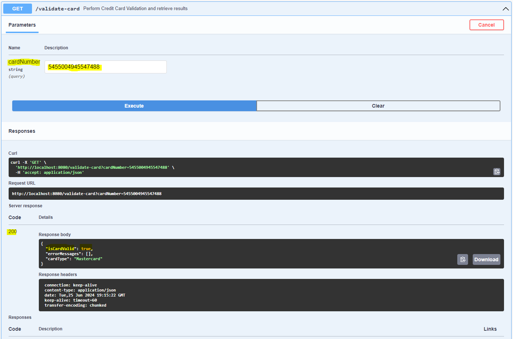
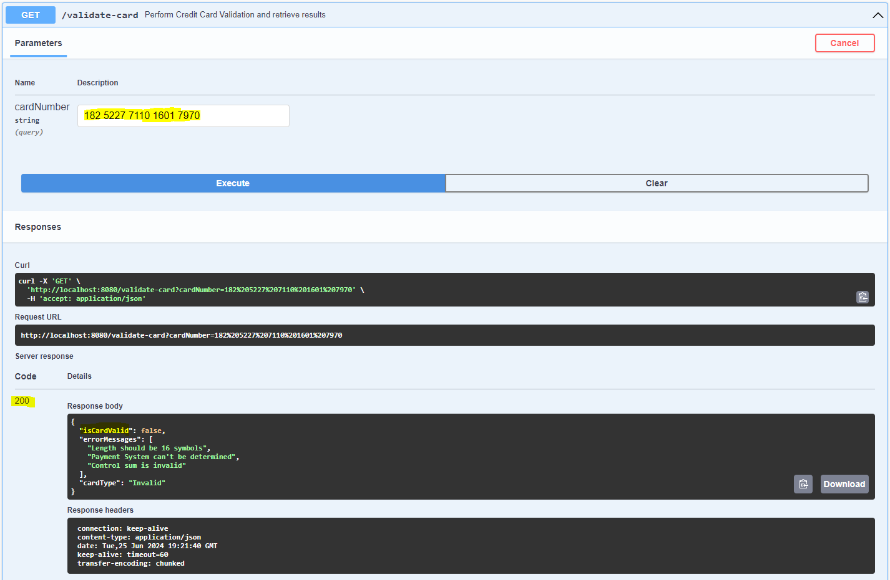

# Credit Card Validator Api

 

The credit card validator API accepts requests with a request parameter "cardNumber" for the credit card number being validated. A JSON response is returned with the values isCardValid showing whether the card is valid, an array of validation error messages showing why the card is not valid, and "cardType", which displays the type of credit card provided.
  

### Swagger Examples
  

The above picture shows a <strong>valid</strong> response for credit card #: <strong>5455 0049 4554 7488</strong>
   

 
The above picture shows an <strong>invalid</strong> response for credit card #: <strong>182 5227 7110 1601 7970</strong> 

  
### Postman Examples

 

The above picture displays an invalid response

 

 

The above picture shows a valid response

 

## Testing

 

 

A total of 35 unit tests were run to test the classes within the project, and all have passed successfully.
 
Below some of the specific tests that were run

 

